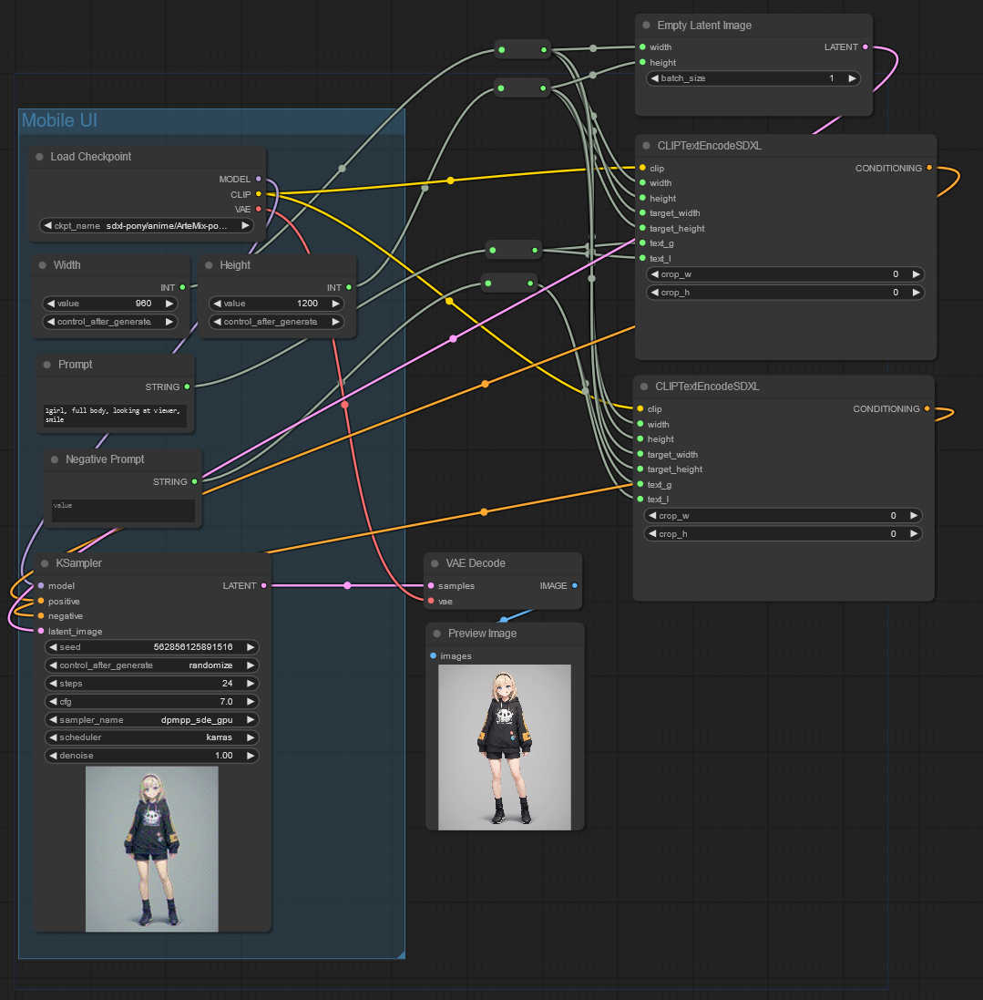
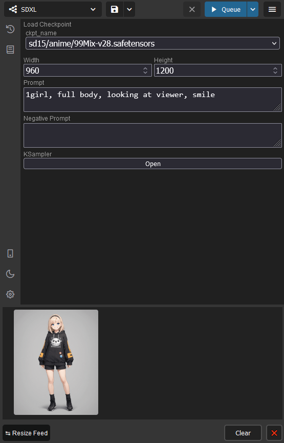

# ComfyUI MobileForm

> [!WARNING]
> Currently MobileForm is in a "proof-of-concept" state; expect bugs and breaking changes.

MobileForm is an extension for [ComfyUI](https://github.com/comfyanonymous/ComfyUI), providing simple form for any workflows, suitable for use on mobile phones.

## Example

Here's a simple workflow for SDXL.



A "mobile-friendly" form will be automatically created based on that workflow.



## How to Use

MobileForm can only be used with the new menu layout. Ensure that the "Use new menu and workflow management." setting is set to either 'Top' or 'Bottom'.

1. Create a group, and change its title to "Mobile Form" or "Mobile UI".
   - You can change the title of a group by right-clicking it, clicking "Edit Group", then "Title".
2. Inside the group, put nodes you want to add to the form.
   - The top left corner of the node must be contained in the group.
   - Rows will be determined based on top position of nodes.
3. Save the workflow and refresh the page. Click the sidebar button with mobile phone icon to see the form.

Simple primitive nodes for numbers and text works the best. Other nodes may or may not work.

## Installation

At the `custom_nodes` directory of your ComfyUI installation, clone this repository, which can be done via following git command.

```bash
git clone https://github.com/123jimin/ComfyUI-MobileForm
```
